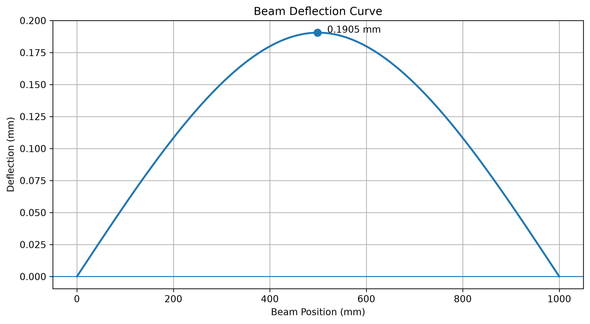
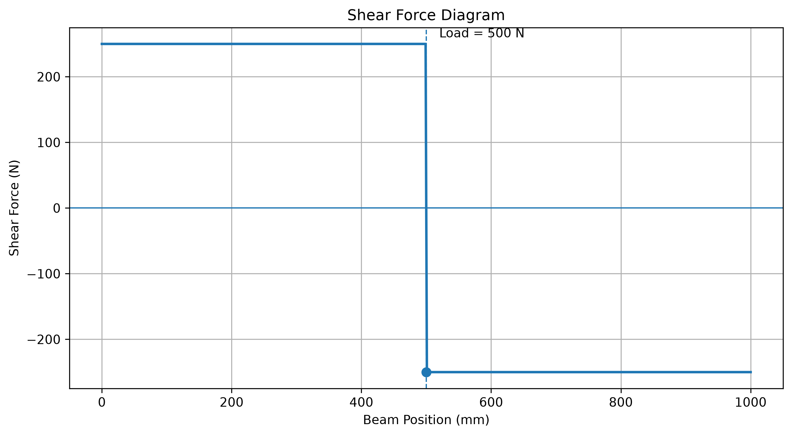
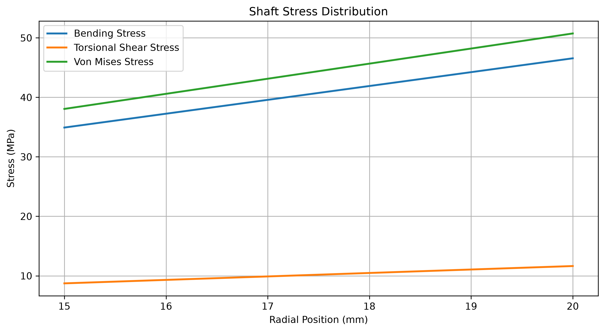
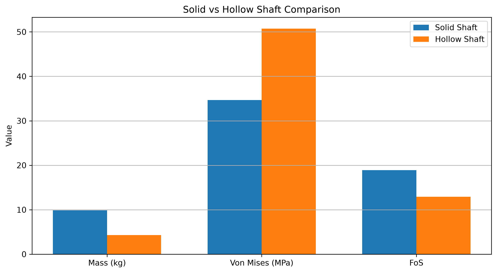

# Beam & Shaft Stress Analysis Calculator

A Python-based mechanical engineering analysis tool for evaluating the structural behaviour of beams and shafts under specified loading, geometry, and material conditions.

The project contains two independent analysis modules:

- **Beam Analysis**
- **Shaft Analysis**

The program performs analytical calculations and automatically generates engineering plots for visual interpretation of the results.

---

## Project Overview

This project was developed as a computational mechanical engineering tool for studying basic structural behaviour using Python.

### Main capabilities

- Beam bending analysis
- Shear force calculation
- Bending moment calculation
- Beam deflection calculation
- Bending stress calculation
- Shaft bending stress analysis
- Torsional shear stress calculation
- Von Mises stress calculation
- Factor of Safety calculation
- Angle of twist calculation
- Solid vs. hollow shaft comparison
- Automatic engineering plots
- Material selection for analysis

----

# 1. Beam Analysis

The beam module evaluates a simply supported beam subjected to a concentrated load.

### Calculated parameters

- Support reactions
- Shear force
- Bending moment
- Bending stress
- Maximum deflection
- Deflection position
- Factor of Safety
- Structural status

The program also generates graphical representations of the calculated response.
---
# 2. Shaft Analysis

The shaft module evaluates the structural behaviour of a shaft subjected to bending and torsional loading.

Both **solid** and **hollow** shaft configurations can be analysed.

### Calculated parameters

- Cross-sectional area
- Area moment of inertia
- Polar moment of inertia
- Volume
- Mass
- Bending stress
- Torsional shear stress
- Von Mises stress
- Angle of twist
- Factor of Safety
- Structural status

---

## Stress Distribution

The shaft module generates the stress distribution across the radial position of the shaft.

The plot provides a visual comparison of:

- Bending stress
- Torsional shear stress
- Von Mises stress

---

# 3. Solid vs Hollow Shaft Comparison

The tool can compare a solid shaft with a selected hollow shaft configuration.

The comparison includes:

- Mass
- Bending stress
- Torsional shear stress
- Von Mises stress
- Factor of Safety
- Mass reduction

---

# 4. Materials

The beam analysis module provides selectable engineering materials with corresponding elastic modulus and yield-strength values.

The shaft analysis also incorporates material properties required for stress and safety calculations.

The material database can be extended as additional materials are required.

---

# 5. Technologies Used

- **Python**
- **NumPy**
- **Matplotlib**

### Python modules

```text
beam.py
shaft.py

---

## Analysis Results

### Beam Deflection


### Bending Moment Diagram


### Shear Force Diagram


### Shaft Stress Distribution


### Solid vs Hollow Shaft Comparison


---

## How to Run

### Requirements

Python 3.x

Install dependencies:

```bash
pip install -r requirements.txt
```

### Beam Analysis

Run:

```bash
python beam.py
```

### Shaft Analysis

Run:

```bash
python shaft.py
```
